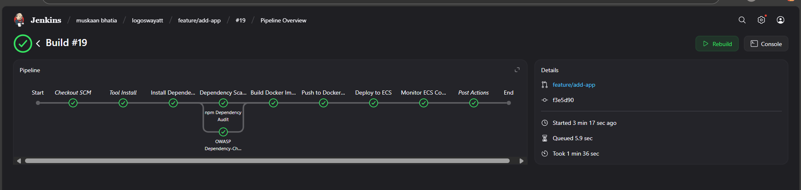
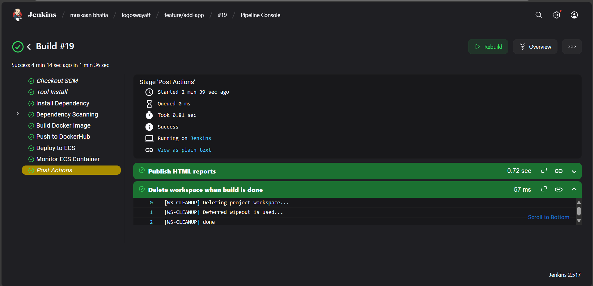
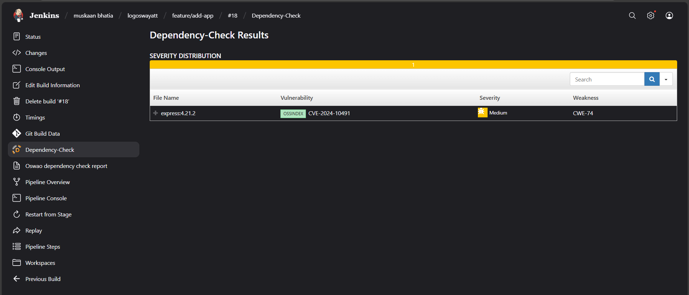
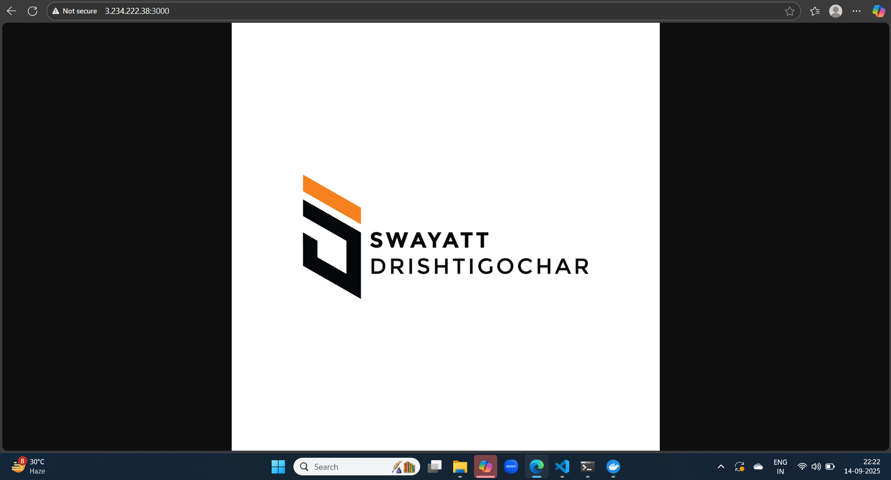

## Jenkins CI/CD Pipeline for AWS ECS

This project automates build → scan → Docker push → ECS deploy → monitor for a Node.js app using Jenkins.

## Workflow

Install Dependencies – npm install

Security Scan – npm audit + OWASP Dependency-Check (HTML report)

Build & Push Docker Image – Tagged with Git commit and pushed to DockerHub

Deploy to AWS ECS (Fargate) – Registers a new task definition and updates the service

Monitor – Fetches CPU/Memory metrics from CloudWatch

Report – Publishes OWASP HTML report in Jenkins

## Tools & Services

Jenkins – CI/CD automation

Node.js & npm – Build & dependencies

OWASP Dependency-Check – Vulnerability scan

Docker + DockerHub – Containerization & registry

AWS ECS & CloudWatch – Deployment & monitoring

AWS CLI & JQ – ECS task definition updates

HTML Publisher Plugin – Publish OWASP report

## Possible Improvements

Can perform testing through sonarqube SonarQube code analysis
Enable Alerts using metrics logs through cloud watch

## Jenkins Pipeline

## Dependency report

## Application  

Accessible on url : http://3.234.222.38:3000/

